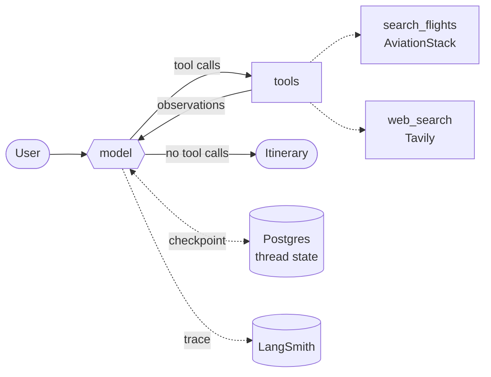

<div align="center">

# ✦ Voyanta

**A production-grade LangGraph agent that turns a vague travel wish into a
day-by-day itinerary — and refuses to invent a single fare it can't cite.**

[](https://langchain-ai.github.io/langgraph/)
[](https://python.langchain.com/)
[](https://smith.langchain.com/)
[](https://fastapi.tiangolo.com/)
[](https://www.python.org/)
[](https://nextjs.org/)
[](https://www.postgresql.org/)

[**▶ Watch the demo**](https://drive.google.com/file/d/1_DaVphHjVWr5LA3_63FxbwOYUNO1Jm6L/view?usp=drive_link)
· [Agent design](#-agent-design) · [Anti-hallucination](#-the-hallucination-problem-and-how-voyanta-answers-it)
· [Streaming](#-streaming-the-agents-reasoning-not-just-its-answer) · [Observability](#-observability-the-feedback-loop)

</div>

---


---

## What this is

Most "AI travel planner" demos are a prompt in a text box. Voyanta is the other thing:
a **tool-calling agent with durable memory, a streamed reasoning trace, per-run
observability, a user feedback loop, and a metered business model** — the whole path
from a ReAct loop to something a stranger can sign up for and pay for.

The interesting engineering isn't that an LLM writes an itinerary. It's everything built
around it so the itinerary can be **trusted, debugged, resumed, and paid for**.

| | |
|---|---|
| 🧠 **Agent** | LangGraph ReAct loop, two purpose-built tools, a prompt engineered as a guardrail rather than a persona |
| 🛬 **Grounding** | Live flight operations (AviationStack) + cited web search (Tavily). No number reaches the user without a source |
| 💾 **Memory** | Postgres checkpointing — a conversation survives a server restart, a deploy, or a closed laptop |
| 📡 **Streaming** | A custom SSE contract that streams **tokens *and* tool calls**, so the user watches the agent think |
| 🔭 **Observability** | Every run traced to LangSmith with a pre-generated `run_id`, joined to structured JSON logs, with 👍/👎 written back onto the trace |
| 💳 **Product** | Accounts, per-user threads, monthly turn quotas, Stripe subscriptions — the agent as a business, not a notebook |

**~7,600 lines** across a Python backend and a TypeScript frontend, each independently
deployable and Dockerised.

---

## 🧠 Agent design

The agent is a **ReAct loop** — the model reasons, calls a tool, reads the result, and
loops until it has enough to answer. Deliberately not a hand-assembled `StateGraph`:

```python
agent = create_agent(
    model=build_model(),          # gpt-4.1, temp 0.3, hard timeout, bounded retries
    tools=TOOLS,                  # search_flights, web_search
    system_prompt=SYSTEM_PROMPT,  # the guardrail — see below
    checkpointer=checkpointer,    # AsyncPostgresSaver — durable threads
)
```

> **Why ReAct and not a fixed pipeline?**
> A travel request has no fixed shape. "Plan Bali for 3 days" needs two searches; "is my
> flight delayed" needs one lookup and no itinerary at all. A `research → itinerary →
> budget` StateGraph would run all three every time and pay for the ones it didn't need.
> The loop is the right abstraction *until* the stages become genuinely fixed — and that
> trade-off is written down in [`graph.py`](backend/app/agent/graph.py) rather than
> rediscovered later.

The checkpointer is **injected, not assumed**: the API passes `AsyncPostgresSaver` for
durable threads, while [`scripts/cli_chat.py`](backend/scripts/cli_chat.py) passes
`InMemorySaver` so the agent can be debugged in a terminal with **no database at all**.
Same graph, two lifetimes.



### The tools

Both tools follow a rule most tutorial code breaks: **a tool never raises into the graph.**
An exception aborts the whole run and the user sees nothing. A returned error *string* lets
the model apologise, adapt, and carry on.

<table>
<tr><th width="50%">🛬 <code>search_flights</code></th><th width="50%">🌍 <code>web_search</code></th></tr>
<tr valign="top"><td>

Live operational data from AviationStack — airline, flight number, status, terminal, gate,
scheduled time, delay.

The hard part isn't the HTTP call, it's **entity resolution**. Models say "Bali", "Japan"
and "NRT" and mean the same class of thing. A layered resolver handles all three:

1. Exact IATA code
2. Curated city map (`bali → DPS`)
3. Country → primary hub (`Japan → NRT`), via `pycountry`
4. Scored fuzzy match over the full `airportsdata` set

> The curated layer exists because the generic search resolves **"bali" to Bali, Cameroon
> (BLC)** instead of Denpasar. That's the kind of bug that only surfaces in a trace, and
> only if you're actually reading them.

Unresolvable input returns an **actionable error to the model**, never a silently widened
query — a worldwide flight dump is worse than an honest failure.

Exception messages are never interpolated into output, because the message carries the
request URL and the URL carries the API key.

</td><td>

Tavily search, five results per call, each with title, URL and snippet — the shape that
makes citation possible downstream.

The client is built **lazily behind an `lru_cache`**. Constructed at import time, a missing
API key becomes a traceback at server boot; built on demand, it becomes a recoverable
message the model can relay to the user.

Failures are caught broadly *on purpose* — with a `noqa` explaining why. In an agent, a
tool error is **content**, not an exception. The model needs to read it.

The docstring is written **for the model, not for a human reader**: it enumerates exactly
which questions belong here (visas, weather, transport, fares, safety) and even models a
good query — because in a ReAct loop, the docstring *is* the routing logic.

</td></tr>
</table>

---

## 🛡 The hallucination problem, and how Voyanta answers it

This is the core AI-engineering problem in the product. AviationStack returns flight
*status* and **no fare data whatsoever**. An LLM shown a flight schedule will happily quote
a price for it. That single failure mode would make the product worthless — a travel
planner that invents fares is worse than no planner at all.

The defence is **layered, because one layer always leaks**:

| Layer | Where | What it does |
|---|---|---|
| **1. Tool docstring** | [`flight_tool.py`](backend/app/tools/flight_tool.py) | `IMPORTANT: this returns live operational flight data ONLY… Never quote a price from this tool's output.` The model reads this at call time, in context. |
| **2. System prompt** | [`prompts.py`](backend/app/agent/prompts.py) | Five non-negotiable rules: never invent a price, flight number, departure time or opening hour; fares go through `web_search` and are **labelled estimates**; cite returned URLs; report tool failures plainly; respect the stated budget instead of quietly exceeding it. |
| **3. Tool routing** | Prompt + docstrings | Fare questions are *routed away* from the flight tool toward cited web search. The guardrail isn't "don't lie" — it's "here is the legitimate path to that answer." |
| **4. Empty-result copy** | Tool return strings | A valid route with no live flights returns text that **explains why it's empty and names the alternative**, instead of a bare `[]` the model will paper over. |
| **5. Visible trace** | [`tool-trace.tsx`](frontend/components/chat/tool-trace.tsx) | The user sees every tool call, its arguments, and a preview of what came back. A fabricated claim has no supporting row — the UI makes hallucination *checkable*, not merely discouraged. |

The system prompt also carries the **output contract** — `### Day N` headings with
Morning / Afternoon / Evening / Stay, a budget table, a "Good to Know" block — plus an
explicit instruction to name real neighbourhoods and dishes rather than filler like
"explore the local culture". Structure and specificity are engineered, not hoped for.
Requirement-gathering is bounded too: ask for what's missing, **at most two questions at a
time**, and start as soon as there's enough to be useful.

> The prompt is treated as **source code with a rationale**: its module docstring states
> *why* it exists — "to stop the model inventing prices" — so the next person doesn't
> weaken a rule that's load-bearing.

---

## 📡 Streaming: the agent's reasoning, not just its answer

Anyone can stream tokens. Voyanta streams **the ReAct loop itself** — you watch the flight
board being read, then the web being searched, then the itinerary being written.

```
event: metadata    {thread_id, run_id}     once, first
event: token       {content}               model tokens, as generated
event: tool_start  {name, args}            the agent reaches for a tool
event: tool_end    {name, preview}         what came back
event: done        {thread_id, run_id}     always last — including after an error
event: error       {message, run_id}       in-band failure
```

Four decisions here aren't obvious until they bite:

**① Filter tokens by graph node.** LangGraph's `messages` stream carries every message in
the graph, including `ToolMessage`s and anything a future LLM-backed tool emits. The
endpoint filters on `AIMessageChunk` **and** `langgraph_node == "model"`, so only the answer
reaches the user's screen. The node name is exported as a constant from the agent module so
the API and the graph can't silently disagree.

**② Errors must be caught *inside* the generator.** Once `StreamingResponse` starts, the
status is already `200`. Raising there sends a truncated body under a success code and the
client hangs forever. The generator catches, emits an `error` frame, and still emits `done`.

**③ The `run_id` is generated *before* the run starts.** A post-hoc trace collector hands
you an id only after the response is flushed — too late to tell the client which trace
produced the answer it's reading. Pre-generating is what makes the entire feedback loop
possible.

**④ Ownership is resolved before the first byte.** A `404` can't be sent once streaming has
begun, so thread ownership is checked while an HTTP status is still negotiable.

On the client, [`use-chat.ts`](frontend/hooks/use-chat.ts) is a small state machine that
reads `response.body` directly (`EventSource` can't do POST), splits SSE frames on the
blank-line terminator, and **buffers whatever partial frame is left at the end of each
chunk** — the bug that produces mysterious dropped tokens under load.

> **Markdown is re-parsed on a 60ms timer, not per token.** Tokens arrive far faster than
> anyone reads. Parsing each one makes long itineraries stutter; accumulating in a ref and
> flushing on an interval keeps a 900-word plan smooth.

---

## 💾 Durable, per-user agent memory

Conversation state lives in Postgres via LangGraph's `AsyncPostgresSaver`, so a thread
survives a restart, a redeploy, and a closed laptop.

LangGraph's checkpointer owns message history but has **no concept of who a thread belongs
to or what it's called** — so [`schema.sql`](backend/app/db/schema.sql) adds exactly that
and nothing more. The `threads.id` **is** the LangGraph `thread_id`: one identifier spans
both systems, and the app table becomes the ownership index the checkpoint tables lack.

Two details that separate a demo from a deployment:

- **Authorization lives in the SQL.** Every thread query filters on the session's `user_id`
  in the statement itself — there is no code path that reads a thread without proving
  ownership. Someone else's thread returns **404, not 403**, so thread ids can't be probed
  for existence.
- **Tool calls must not replay.** `ainvoke` returns the *entire* checkpointed thread, not
  just this turn. Reporting tool calls straight off it would replay every call the
  conversation ever made, so `_current_turn()` walks back to the latest `HumanMessage` and
  reports only from there.

---

## 🔭 Observability: the feedback loop

Tracing itself is free — LangChain reads `LANGSMITH_*` from the environment. What's built
here is everything that makes traces **usable**.

```
👍 / 👎 in the UI  →  run_id  →  LangSmith trace  →  filter to thumbs-down
                                                  →  a bug queue ranked by real user pain
```

- **Every run is tagged**: `thread_id`, `user_id`, `app_version`, `model`, `environment`.
  `thread_id` goes into *both* `configurable` and `metadata`, because LangSmith groups runs
  into conversation Threads by the metadata key.
- **Logs join to traces.** [`logging_config.py`](backend/app/logging_config.py) emits JSON
  carrying `request_id` **and** `run_id` from context vars. A user reports a bad answer →
  find the log line → it hands you the exact trace. Without that link you're grepping
  timestamps.
- **Feedback runs as a `BackgroundTask`.** A slow or failing LangSmith call must never
  propagate — the user's message already succeeded.
- **Import order is load-bearing.** `app.config` is the first import in
  [`main.py`](backend/app/api/main.py) because it calls `load_dotenv()`, and LangChain reads
  `LANGSMITH_*` at import time. Import LangChain first and **tracing silently stays off** —
  the worst kind of failure, because everything still appears to work.

---

## 🎛 Running the agent as a product

The AI is the hard part; shipping it to strangers is the rest of the job.

<table>
<tr valign="top"><td width="33%">

**Metering**

One **turn** = one message and its reply — not tokens. Nobody can look at "140,000 tokens
left" and know whether that's a lot.

The turn is **reserved before the model runs**, as a single conditional `UPSERT`. Counting
afterwards lets two concurrent requests both read "19 used" and both proceed. A run that
fails before producing anything hands its turn back; a cancelled one doesn't — the tokens
were still bought.

</td><td width="33%">

**Degrading honestly**

With no Stripe keys configured, quotas are still **counted but never enforced**. A cap with
no way to pay past it isn't a business model, it's an outage.

Exhaustion answers **402, not 403**, so the client can tell "you're not signed in" from
"you are, but this costs money" — and raise an upgrade dialog carrying the *backend's* own
wording. The client never decides that the allowance is spent.

</td><td width="33%">

**Guardrails on spend**

Per-IP rate limiting on the chat endpoints (LLM calls cost money), a hard request timeout so
a hung OpenAI call can't hold a worker open forever, bounded retries, and a
`recursion_limit` that stops a looping agent from billing indefinitely.

</td></tr>
</table>

Also here because production demands it: Argon2 password hashing with a **dummy-hash timing
equaliser**, so a failed login costs the same whether or not the account exists; opaque
session tokens stored **only as SHA-256**, so a database dump yields no usable session; a
global exception handler so no traceback ever reaches a client; a `/health` check that
performs a **real `SELECT 1`** rather than reporting healthy while Postgres is down; and
Stripe webhooks made idempotent by an events table and **re-fetched rather than trusted**,
because Stripe doesn't promise delivery order.

---

## 🖥 The interface

The frontend exists to make the agent legible, not to decorate it. A **departure-board**
visual language — ink background, one sodium-amber accent, hairline rules, monospace row
labels — because the product's honest claim is *live operational data*, and the UI should
look like the board it reads from.

<p align="center">
  
  
</p>
<p align="center">
  
  
</p>

**The browser never calls FastAPI directly.** Every request goes through a Next.js proxy at
`/api/voyanta/*`, keeping calls same-origin — so **CORS never applies** and the backend's
address never reaches the client. The one deliberate exception is the Stripe webhook, which
must hit the API directly: the signature is computed over the exact bytes of the body, and
a proxy that re-encodes JSON invalidates it.

---

## ⚡ Quickstart

Two terminals. Backend first — the frontend has nothing to talk to without it.

```bash
cd backend
uv sync
cp .env.example .env          # OPENAI, TAVILY, AVIATIONSTACK, DATABASE_URL, LANGSMITH
uv run uvicorn app.api.main:app --reload --port 8000
```

```bash
cd frontend
pnpm install
pnpm dev
```

App → <http://localhost:3000> · API docs → <http://localhost:8000/docs>

**Just want to poke the agent?** No database, no frontend, no accounts:

```bash
cd backend && uv run python scripts/cli_chat.py
```

**Or the whole stack:** `docker compose up --build`

---

## 🏗 Stack & layout

| Layer | Choice |
|---|---|
| **Agent** | LangGraph 1.2 · LangChain 1.3 · `langchain-openai` · GPT‑4.1 @ temp 0.3 |
| **Memory** | `langgraph-checkpoint-postgres` · psycopg3 async pool |
| **Tools** | AviationStack · Tavily · `airportsdata` + `pycountry` resolution |
| **Observability** | LangSmith traces + feedback · structured JSON logs with request/run correlation |
| **API** | FastAPI · SSE streaming · Pydantic v2 settings · SlowAPI rate limiting |
| **Auth & billing** | Argon2 · hashed opaque sessions · Stripe subscriptions + webhooks |
| **Frontend** | Next.js 16 (App Router) · React 19 · Tailwind v4 · shadcn/ui (Base UI) |
| **Tooling** | Python 3.14 · uv · Ruff · pnpm · TypeScript · Docker Compose |

```
Voyanta/
├── backend/
│   ├── app/
│   │   ├── agent/            graph.py — the ReAct loop · prompts.py — the guardrail
│   │   ├── tools/            flight_tool.py (resolution + AviationStack) · tavily_tool.py
│   │   ├── api/              main.py (lifespan, health) · routes/ (chat, threads, feedback, billing)
│   │   ├── auth/             argon2 passwords · opaque hashed sessions
│   │   ├── billing/          quota.py (atomic reservation) · stripe_gateway.py
│   │   ├── observability.py  LangSmith run config + feedback
│   │   ├── logging_config.py JSON logs carrying request_id + run_id
│   │   └── db/schema.sql     idempotent, applied on every boot
│   └── scripts/cli_chat.py   Terminal REPL — in-memory, no database
└── frontend/
    ├── app/                  marketing · auth · /chat/[threadId] · proxy to FastAPI
    ├── components/chat/      workspace · sidebar · message-row · composer · tool-trace
    ├── hooks/use-chat.ts     the streaming state machine
    └── lib/voyanta.ts        typed client for the backend contract
```

Deeper reference: **[backend/README.md](backend/README.md)** (endpoints, SSE contract,
Stripe setup) · **[frontend/README.md](frontend/README.md)** (client architecture).

---

## 🔭 Known limits & what's next

Stated plainly, because a README that claims no edges isn't describing real software:

- **No automated eval suite yet.** Quality is currently governed by prompt guardrails and
  the LangSmith 👍/👎 loop. The natural next step is a golden set of travel requests scored
  for citation coverage and fabricated-figure rate — the feedback plumbing already exists to
  feed it.
- **Rate limiting keys on IP**, so behind a proxy every user shares one bucket. Per-user
  limiting is the fix.
- **No password reset or email verification.**
- **Fares are estimates by design.** AviationStack has no pricing. Swapping in Amadeus means
  changing exactly one function — `_fetch_flights` in `flight_tool.py`.
- **LangSmith traces carry full user messages.** Review before handling personal or payment
  data.
- **The schema is applied on boot and must stay idempotent.** Alembic is the answer when a
  column needs to change shape rather than merely appear.

---

<div align="center">

**Built by [syket](https://github.com/syket-git)** — agent architecture, prompt engineering,
tool design, streaming infrastructure, observability, and the product built around them.

</div>
